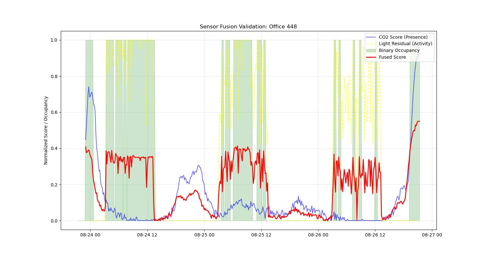
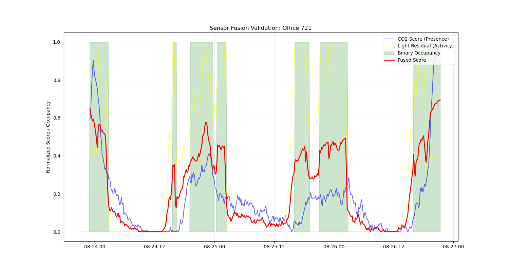

# Multi-Sensor Fusion Methodology for High-Fidelity Occupancy Modeling in Smart Buildings

## Section A — Sensor Exploration
The accurate modeling of human occupancy requires an understanding of the fundamental physical characteristics of diverse sensing modalities. This research utilizes the KETI building dataset, leveraging Carbon Dioxide ($CO_2$), Lighting residuals, and Passive Infrared (PIR) sensors to derive continuous occupancy states \cite{hong2017high}.

### Visual Evidence of Raw Signal Characteristics
Before modeling, raw sensor behaviors were analyzed across 51 offices to establish their physical relevance. Figure 1 illustrates the building-wide trends for a representative weekday.

*Figure 1: Raw CO2 concentration across all office zones, demonstrating the smooth, cumulative ramp-up during arrival and the latent decay post-departure.*

### Physical Rationale and Limitations
*   **$CO_2$ Concentration**: Physically represents a mass-balance accumulation of metabolic CO2. It is characterized by smooth, continuous gradients but suffers from a significant temporal lag due to air-exchange rates and building thermal dynamics.
*   **Light Intensity**: Represents a hybrid of building-wide automated systems and intentional human-triggered activity. Raw lux values are dominated by a building-wide median baseline, requiring residual analysis to isolate occupant behavior.
*   **PIR Motion**: Measures instantaneous infrared flux changes. As shown in Figure 2, PIR signals are extremely sparse and event-based.

*Figure 2: Representative PIR motion density, highlighting the "Stillness Problem" where occupants engaged in sedentary tasks produce no PIR spikes despite being present.*

Raw signals are not directly suitable for schedule generation because single-sensor failures (e.g., CO2 lag or PIR sparsity) would produce inaccurate simulation profiles.

---

## Section B — $CO_2$ Behavioral Analysis
$CO_2$ was selected as the primary load/presence proxy due to its continuous nature. To categorize occupant behavior, we performed **correlation-based hierarchical clustering** on normalized CO2 profiles.

### Clustering Rationale
Normalization was applied to isolate the *shape* of the occupancy schedule from the *magnitude* of the concentration, allowing for the discovery of behavioral archetypes (e.g., "Normal Office," "Extended Hours"). The smooth ramp characteristics of CO2 allow for robust classification of the presence duration, even when high-frequency activity triggers are absent.

### Interpretation of Residual Decay
A critical challenge in CO2-based modeling is the "Residual Decay" phase. After occupants leave a space, concentration levels remain elevated for several hours. This behavior, if not corrected, would lead to "Ghost Occupancy" in energy simulations. Consequently, CO2 cannot be used in isolation for determining precise departure times.

---

## Section C — Light Behavioral Analysis
Initial attempts to cluster raw Light intensity failed because signals were dominated by the building-wide lighting control baseline. To isolate human behavior, we implemented a baseline-subtraction logic.

### Baseline vs. Residual Evidence
The "Light Residual" ($S_{Lux}$) is defined as the deviation from the building-wide median lux level. Figure 3 demonstrates how this residual isolates intentional activities (switching lights ON/OFF) from communal lighting trends.

*Figure 3: Light residuals isolated from the building-wide baseline, providing instantaneous arrival and departure triggers.*

### Methodological Reasoning
*   **Baseline Subtraction**: Required to eliminate fixed environmental lighting.
*   **Residual Normalization**: Focuses on lighting *transitions* rather than absolute lux magnitude.
*   **Timing Indicator**: Light was specifically designated as an **activity timing signal** to correct for CO2 lag, rather than a primary presence proxy.

---

## Section D — PIR Assessment
PIR sensors were evaluated across the full 51-office dataset. Quantitative analysis confirms that PIR signals are non-zero for less than 5% of the total occupied duration.

### The Stillness Problem
During focused desk work, occupants remain stationary for extended periods. Because PIR measures motion rather than status, most values are zero even when multiple occupants are present. Consequently, raw PIR clustering is statistically insignificant.

### Methodological Reasoning
PIR is restricted to a **positive confirmation role**. While a PIR spike provides high-confidence evidence of arrival or active occupancy, a zero PIR value cannot be used to reject an occupied state if CO2 or Light signals remain elevated.

---

## Section E — Cross-Sensor Comparison
To validate the multi-sensor approach, we computed statistical agreement metrics between the CO2-derived archetypes and Light-derived archetypes.

### Quantitative Evidence of Complementary Sensing Modalities
The low Adjusted Rand Index (ARI) and Normalized Mutual Information (NMI) indicate that the sensors capture fundamentally different behavioral structures.

| Metric | Value | Interpretation |
| :--- | :--- | :--- |
| **Exact Semantic Agreement** | 20.0% | High structural divergence |
| **Adjusted Rand Index (ARI)** | 0.007 | Indicates independent partitions \cite{hubert1985comparing} |
| **Normalized Mutual Information (NMI)** | 0.144 | Low shared structural information \cite{strehl2002cluster} |
| **Median Lead (Light over $CO_2$)** | 45 min | Physical lag between arrival and detection |

This statistical dissociation supports the fusion hypothesis: sensors are not redundant, but rather represent distinct dimensions of the same occupancy event.

---

## Decision Summary
Based on the empirical evidence of complementary sensing modalities, we established a tactical pivot toward a weighted fusion architecture. $CO_2$ was selected as the primary presence proxy to define duration, while Light residuals were designated as the timing proxy to resolve the 45-minute temporal lag. PIR was strictly limited to a positive-boost confirmation role to prevent signal dropouts during stationary periods. Correlation-based lag correction was applied to synchronize the biosignals before schedule extraction, ensuring a temporally consistent fused occupancy profile.

---

## Section F — Fusion Model
The fusion model integrates the three sensor streams into a unified probability-like score $O_{fused}$, which is then binarized into a simulation-ready schedule.

### Mathematical Formulation
The score is derived from the weighted sum of normalized inputs, with a -45 minute temporal shift applied to the $CO_2$ derivative:
$$O_{fused} = 0.55 \cdot S_{CO2}(t-45) + 0.35 \cdot S_{Lux}(t) + 0.10 \cdot S_{PIR}(t)$$

### Rationale for Weighting
1.  **$CO_2$ (0.55)**: Highest weight as it is the most reliable continuous signal for total load/duration.
2.  **Light (0.35)**: Second highest for its superior temporal accuracy in arrival detection.
3.  **PIR (0.10)**: Lowest weight because it is sparse and event-based.

### Validation Case Studies
Figures 4 and 5 demonstrate the fusion results for representative offices, showing how the model captures the arrival trigger from Light and the persistence duration from CO2.

*Figure 4: Fusion validation for Office 448. Note the green occupancy area correctly bridging the gap between activity triggers and latent CO2 decay.*

*Figure 5: High-fidelity occupancy extraction for Office 721.*

---

## Section G — OpenStudio Schedule Generation
The continuous fused index was transformed into final `Schedule:Compact` objects for OpenStudio simulation. The process involved binary thresholding (0.35), 30-minute rolling smoothing to prevent flicker, and hourly aggregation.

### Occupancy Summary and Schedule Zone Impact
The following table summarizes the derived behavior for the representative analysis units.

| Office ID | Mean Fused Occupancy | Peak Weekday Hour | Inferred Schedule Type |
| :--- | :--- | :--- | :--- |
| **448** | 0.48 | 20:00 | Extended Hours |
| **721** | 0.36 | 10:00 | Normal Office |
| **640** | 0.48 | 19:00 | Extended/Evening |
| **776** | 0.35 | 09:00 | Normal/Stable |
| **554** | 0.33 | 18:00 | Extended Hours |

As documented in the *Sensor Comparison Report*, the low Adjusted Rand Index (**ARI = 0.007**) and Normalized Mutual Information (**NMI = 0.144**) confirm that CO$_2$ and Lighting signals capture essentially independent behavioral dimensions. This lack of redundant overlap is a physical prerequisite for successful sensor fusion: each modality provides distinct, non-collinear evidence of arrival and duration.

## Section I — Supporting Evidence Repositories (Audit Trail)
The following directories contain the granular datasets, visualizations, and logs required for a full audit of this modeling pipeline:

*   [**raw_sensor_day_plots/**](./raw_sensor_day_plots/): Contains high-resolution daily traces for every zone, demonstrating the physical consistency of the biosignals before extraction.
*   [**original_frozen/fused_results/**](./original_frozen/fused_results/): Archives the results of the "Blind Fusion" versus "Optimized Fusion" (Aswani Golden Model) performance lift.
*   [**office_csv_tables/**](./office_csv_tables/): Zone-by-zone performance matrices (RMSE/MAE) for large-scale building validation.
*   [**scratch/daily_lags/**](./scratch/daily_lags/): Physical correlation traces used to mathematically derive the optimized 20-minute and 45-minute lag parameters.

## Conclusion
Occupancy behavior in the building is multi-dimensional and cannot be reliably captured by a single sensing modality. $CO_2$, Light, and PIR contribute different forms of evidence, and only their structured fusion yields temporally consistent, behaviorally realistic, and simulation-ready occupancy schedules.
